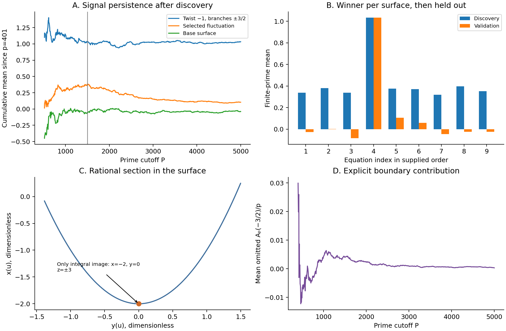

## Result

The strongest signal in the supplied sweep corresponds to an explicit, non-torsion rational section. Its finite-prime mean persists on an independent prime window. Nevertheless, the section has only two integer points in its image. This supplies a demanding positive control for the tool: detecting structure and reaching the required arithmetic conclusion are different tasks.

The equation carrying the signal was already solved by a different polynomial family in March 2026. The contribution of this audit is reconstruction, verification, and improved diagnostics, not a new solution of that equation. Six equations in the original nine remain listed as open in Grechuk's revision of 30 August 2026. [Epoch's update](https://epoch.ai/frontiermath/open-problems/small-diophantine), [Grechuk v9, Table 7](https://arxiv.org/html/2404.08518v9).

## 1. Exact problem and current landscape

Write

$$F_{a,b,c}(x,y,z)=z^2+(y^2+a)z+x^3+bx+c.$$

Here $a,b,c$ are coefficients, not crossing numbers, physical charges, or temperatures. The problem asks about integer solutions. Rational points on an auxiliary cover do not settle it.

| Coefficients $(a,b,c)$ | Status in the current literature |
|:---|:---|
| $(0,0,-2),(0,-1,-1)$ | Finiteness problem remains open |
| $(0,0,-3),(0,0,3)$ | Finiteness problem remains open |
| $(0,-1,-2),(0,-1,2)$ | Finiteness problem remains open |
| $(0,1,1),(-1,0,2)$ | Polynomial/congruence families published by Epoch, March 2026 |
| $(0,1,-1)$ | Subsequently solved by the problem authors, according to Epoch |

Epoch's present computational prompt asks for three distinct solutions with distinct $x$ and $|x|>10^{50}$. That finite witness task is different from proving infinitude. We reproduce six such large triples for two already solved equations, with exact arbitrary-precision substitution. They are in `large_integer_witnesses.json`. [Epoch prompt and attribution](https://epoch.ai/frontiermath/open-problems/small-diophantine).

## 2. Replay and held-out experiment

All four supplied programs ran successfully. Three output files match byte for byte. The twist output matches after removing wall-clock durations. The original discovery range is 401–1499: 161 primes, 780 branch pairs, and 74 signed squarefree twists, or 57,720 candidates per surface. Positive twists were already present; the note's suggestion that they had not been searched was incorrect.

We repeated that discovery search, selected up to three overall and three positive-twist candidates per surface, removed duplicates, and froze the resulting 44 candidates. We then evaluated them on all 430 primes from 1511 through 4999. Selection never used this validation block.

The count engine uses an integer number-theoretic transform modulo 998244353. Each recovered character sum is bounded in absolute value by $p$, so signed recovery is unique. This avoids floating-point convolution. There are 12,750 independent direct-sum comparisons, plus direct checks of every fibre in the boundary-control cases. The stored experiment covers 668 odd primes through 4999.

| Candidate | Discovery mean | Validation mean | Interpretation |
|:---|---:|---:|:---|
| $(0,1,1)$, branch $\pm3/2$, twist $-1$ | 1.03365 | 1.03333 | Persistent; exact section reconstructed |
| $(0,-1,-1)$, branch $(-5,1/5)$, twist $-37$ | 0.381 | Approximately 0.000 | Discovery fluctuation fails validation |
| $(0,1,1)$, branch $\pm5/3$, twist $14$ | 0.36121 | 0.05426 | Strong attenuation |
| $(0,1,1)$, branch $\pm2/3$, twist $34$ | 0.35133 | 0.09496 | Strong attenuation |

These are finite character-sum averages, not exact ranks. The leading validation mean has descriptive standard error about 0.068. Such errors are not discovery p-values: candidates are correlated, selected, and sampled through arithmetic prime structure. Absence of a large finite signal is not a rank-zero certificate.

## 3. The section behind the spike

For $F_{0,1,1}=0$, set $w=2z+y^2$, so

$$w^2=y^4-4(x^3+x+1).$$

Let $q=1+u^2$ and $N=u^4-34u^2+1$. The previously missing section is

$$x(u)=\frac{N}{4q^2},\qquad y(u)=\frac{3(1-u^2)}{2q},\qquad w(u)=\frac{3uN}{2q^3}.$$

Exact substitution gives zero. A denominator-free certificate is

$$36u^2N^2-81(1-u^2)^4q^2+N^3+16Nq^4+64q^6=0.$$

**How it was found.** Start with the branch values $x(0)=x(\infty)=1/4$. Seek $x=1/4+k u^2/q^2$ and $w=u(Du^4+Eu^2+F)/q^3$. The coefficient matching condition has the rational root $k=-9$, yielding the expressions above. This replaces a search for unrelated points on individual fibres with a test of a single exact identity across the cover.

**Non-torsion check.** At $u=1$, use $X=-4x$ and $Y=4w$. The section specializes to $P=(8,-24)$ on the nonsingular curve $Y^2=X^3+16X-64$. Exact doubling gives

$$2P=(25/9,37/27).$$

Nagell–Lutz requires rational torsion points on this integral short Weierstrass equation to have integer coordinates. Thus $P$ is non-torsion. A torsion section would specialize to torsion on every smooth fibre, so the section is non-torsion and the cover has rank at least one. This argument does not determine its exact rank. [MIT's Nagell–Lutz formulation](https://math.mit.edu/classes/18.783/2025/ProblemSet3.pdf).

**Integer obstruction.** For rational $u$, $-3/2\leq y\leq3/2$. Hence an integer $y$ must be $-1,0,1$. Solving for the parameter gives

$$u^2=\frac{3-2y}{3+2y}.$$

The values at $y=1,-1$ are $1/5,5$, neither a rational square. Therefore $y=0$ and $u=\pm1$. The section's complete integer image is precisely

$$(-2,0,-3),\qquad(-2,0,3).$$

The whole rational cover also reaches no other integer $y$. Other points on its $y=0$ elliptic fibre are a separate finite-integral-point problem; they must not be confused with this section's two-point image.

## 4. The boundary bookkeeping identity

Let $A_p(y)=\sum_x\chi_p(y^4-4(x^3+x+1))$ and $r=3/2$. The map $\phi(u)=r(1-u^2)/(1+u^2)$ has, on the projective parameter line and over a finite affine base point $y$, multiplicity

$$m_p(y)=1+\chi_p(r^2-y^2).$$

Removing the domain point $u=\infty$, which maps to $y=-r$, gives the exact identity

$$\sum_{u\in\mathbb F_p,\;1+u^2\ne0}A_p(\phi(u))
=\sum_y A_p(y)+\sum_y\chi_p(r^2-y^2)A_p(y)-A_p(-r).$$

This is why the supplied direct-cover average and base-plus-twist average differ slightly. The difference is identifiable boundary information, not a new physical effect. The eye verifies both pointwise multiplicities and this weighted identity. It excludes characteristic two and collapsed or undefined branch points.

This is a useful connection to the earlier transport and peeling work: changing the observable or discarding a boundary contribution changes what the reduced description retains. Here that principle is realized by a concrete finite pushforward. It does not introduce a quantum heat engine, APS operator, or conductivity into an arithmetic problem without a defined bridge.

## 5. Repairs to the original reasoning

1. **Control label.** For the purported rank-zero control $w^2=x^3+y^2+1$, the exact finite-prime score is $r_p-1$, where $r_p$ counts roots of $x^3+1$. It equals two for primes $1\bmod3$ and zero for primes $2\bmod3$. The original full-prime mean, 0.969, already exposes the label error. Keeping only split primes changes the average.
2. **Rank inference.** Rosen–Silverman relates an appropriate weighted limiting trace expression to rank, with precise hypotheses; rational elliptic surfaces are a proved case. A finite mean is not that limit. Our stored weighted partial sums are diagnostics. [Rosen–Silverman, 1998](https://link.springer.com/article/10.1007/s002220050238).
3. **Wrong elimination.** Even a proved rank-zero statement over $\mathbb Q(y)$ would not exclude all polynomial triples with nonlinear $y=Q(t)$. Those define a base change or multisection. Torsion and integrality require separate treatment. The published family below is an explicit counterexample to the note's claimed universal exclusion.
4. **Twist errors.** Standard errors must be recomputed after each prime-dependent character multiplication. A Gaussian maximum heuristic for correlated searches cannot certify absence. We preserve the original code and outputs and put the repairs in new versioned eyes.
5. **Real versus integral escape.** A positive twist or an unbounded real branch does not automatically give an integer orbit. A Pell seed, norm-preserving recurrence, target map, and denominator congruences are separate obligations. Even positive square twist $c=1$ requires special care: the associated split conic is not a nonsquare Pell mechanism.

The exact discriminant identity is $4F=(2z+y^2+a)^2-[(y^2+a)^2-4(x^3+bx+c)]$. Its integer parity follows modulo four; this is checked alongside square detection rather than silently assuming a rational square gives integer $z$.

## 6. Published construction as a positive control

The integer family

$$x=-108t^4-24t^2-2,\quad y=36t^3+2t,\quad z=648t^6+288t^4+50t^2+3$$

satisfies $F_{0,1,1}=0$ identically. Its growing quartic $|x|$ proves infinitely many distinct integer points. We verify the polynomial identity and three instances with $t=10^{13},10^{13}+1,10^{13}+2$. We also verify the published congruence construction for $F_{-1,0,2}$. These results are attributed reproductions. [Epoch's two families](https://epoch.ai/files/open-problems/small-diophantine-two-families.pdf).

The polynomial family has cubic $y(t)$, whereas the original exclusion argument treated a section over the unchanged $y$-line. The successful control therefore explains exactly why that argument was too strong.

## 7. Latest Pell road and AI audit

Grechuk–Agbanwa's July paper uses a tangent identity for polynomial values represented by quadratic forms. We independently check its algebraic core,

$$4m(m+rs+s^2d)=(2m+rs)^2+s^2(4md-r^2),$$

and its published auxiliary seed

$$17006096x^2-688752720=v^2,$$

$$x=22108343594783571,\quad v=91171377945572295096.$$

The new Pell eye derives a positive norm-one unit by continued fractions and checks a three-step arbitrary-precision orbit. This verifies the auxiliary recurrence, not a map to our six unresolved surfaces. The authors report AI-assisted discovery and Aristotle/Lean formalization; we retrieved their Lean source and inspected its statements, but did not independently compile their entire development. [Paper and formalization link](https://arxiv.org/pdf/2607.06627).

The March Ulam investigation is relevant exploratory AI-era work, but its unqualified Picard-rank discussion and finite-search-to-completeness language are not adopted as certificates. Geometric and arithmetic Picard ranks must be distinguished; checking finitely many multiples does not prove that no other integral multiples exist. [Ulam investigation](https://www.ulam.ai/research/frontier-eq.pdf).

## 8. Tool and formal proof scope

Eight new eyes implement integer witnesses, discriminant/parity checks, finite-field fibre transfer, prime evolution, discovery/validation selection, polynomial identities, integer reachability of a circle cover, and Pell orbits. The 172 prior eye versions remain unchanged, giving 180 versions. Their presence does not imply all historical physical investigations have been rerun.

The new registry suite executes 108 cases: 101 successful computations and seven intended refusals. It separately validates exact symbolic identities, six large integer witnesses, the reconstructed section, and the Pell seed. `run_all.py` runs the existing QHE, peeling, and UPG suites plus the new arithmetic suite. The viewer plays recorded prime-cutoff evolution; it does not generate new data while animating.

Seven elementary algebraic statements have been written in an isolated Lean project: discriminant identity, two published-family identities, cleared section identity, positive section denominator, Pell norm preservation, and the tangent identity. All seven compiled successfully in GitHub Actions on Lean 4.33.0; the build record is `formal_status.json` and the axiom output is retained with the logs. The unrelated inherited root build still fails on its existing malformed configuration. No claim of a Lean proof of the six open problems, the complete non-torsion argument, or complete integrality classification is made.

## 9. Next decisive work

The six unresolved equations should be the discovery targets; the solved equations should remain controls. The useful next search is for explicit curves whose rational parameter maps admit unbounded integral orbits, with local congruences and denominators tracked from the start. Candidate ranking can prioritize this search but cannot close it.

For the peeling paper, the transferable method is to retain the discarded contribution explicitly, compare complete and reduced observables, and test whether a persistent signal reaches the actual target observable. This arithmetic success supports the instrument's evidence discipline. It does not constitute experimental evidence for an elemental, electromagnetic, or cosmological cascade.
