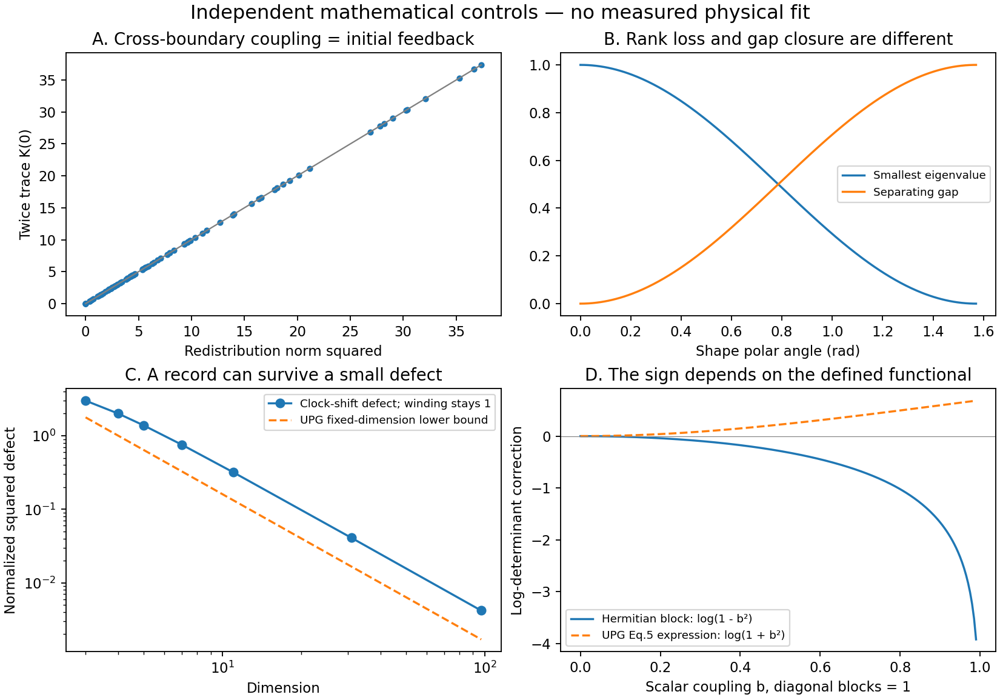

# The result that brings the work together

The new *Universal Projector Geometry from Electrical Measurements* manuscript supplies a useful missing link between the operator cascade and its boundary record. Its redistribution operator detects coupling between retained and hidden sectors. Under a Hermitian model with an orthogonal split, that coupling is exactly what generates a feedback kernel after the hidden variables are eliminated.

This is a finite mathematical statement with a short proof. It is not yet an identification of elemental removal, a measured quantum memory effect, or a universal electrical origin of geometry. The useful organizing principle is more precise: **a reduction must track both what it removes and the response it leaves at the boundary.**

There are four distinct records to follow during a cascade:

1. **Channel support:** which positive weighted directions survive, and when rank actually drops.
2. **Subspace motion:** how the retained projector rotates, with its separating gap recorded.
3. **Elimination memory:** the hidden-sector self-energy, time kernel, and initial hidden forcing.
4. **Topological record:** a named invariant with its branch, normalization, and admissible domain.

None of these four is a substitute for the others. In particular, a constant topological integer does not imply a constant response, and a large projector overlap does not establish non-Markovian dynamics.

# Source and GitHub reconciliation

The new UPG PDF is an August 2026 manuscript. Its source archive contains `upg.tex`, five scientific Python programs, one figure program, and three images. The new three-body v3 PDF is byte-identical to the earlier uploaded v3. Its companion archive repeats the earlier four-file archive: a **v2** PDF and TeX source, plus `biaxial.py` and `conical_ray.py`. Those two programs require `/home/claude/unequal_check.py`, which is absent from the supplied archive and was not found in the available Python sources. The archive is therefore not a complete v3 reproduction release.

The table uses 12-character hash prefixes; complete hashes are retained in the input manifest and GitHub snapshot.

| Source | Hash prefix | Evidence established here |
|---|---|---|
| UPG v2 PDF | `61ec81ae3b35` | Read manuscript and source; inspected the displayed gluing equation visually |
| Three-body v3 PDF | `dd4a3d0868ed` | Exact duplicate; reviewed the claims relevant to rank, gaps and reciprocity |
| GitHub main | `032ec75a360f` | Current main remains the early build state |
| Catalog draft, PR 10 | `3fd7d5efb7a4` | Six original paper records; UPG, Matter and three-body remained in intake |
| Peel formal draft, PR 11 | `4675da5baf7c` | Current peel-specific workflow succeeds; separate root workflow fails |

All eleven existing research PRs remain open drafts in this snapshot. Branch ancestry is not mathematical dependence. The source manifest and GitHub snapshot preserve exact identities; they do not silently designate every draft as accepted mathematics.

The [peel-specific workflow](https://github.com/dicipler-pixel/operator-first/actions/runs/34157983201) reports success. The [separate root workflow](https://github.com/dicipler-pixel/operator-first/actions/runs/34157983166) fails before theorem compilation: the retrieved log reports `lakefile.toml:1:4`, unexpected colon, expected equals sign. This is the previously identified root configuration defect. It does not cancel the isolated peel proof result, and the repository as a whole should not receive an unqualified green label. The existing repair remains in [PR 1](https://github.com/dicipler-pixel/operator-first/pull/1).

# A precise bridge: redistribution equals the source of feedback

Let a finite Hilbert space split orthogonally into retained and hidden sectors. In an adapted orthonormal basis write

$$
P=\begin{pmatrix}I&0\\0&0\end{pmatrix},\qquad
H=H^*=\begin{pmatrix}A&B\\B^*&D\end{pmatrix}.
$$

UPG's operator is

$$
F=(I-P)HP+PH(I-P)=\begin{pmatrix}0&B\\B^*&0\end{pmatrix}.
$$

For $i\dot\psi=H\psi$, with $\hbar=1$, solve the hidden equation exactly:

$$
y(t)=e^{-itD}y(0)-i\int_0^t e^{-i(t-s)D}B^*x(s)\,ds.
$$

The retained equation becomes

$$
\dot x(t)=-iAx(t)-iBe^{-itD}y(0)-\int_0^t K(t-s)x(s)\,ds,
\qquad K(t)=Be^{-itD}B^*.
$$

Its resolvent counterpart is the self-energy

$$\Sigma(z)=B(zI-D)^{-1}B^*.$$

**Finite Hermitian feedback criterion.** The following are equivalent:

$$
F=0\quad\Longleftrightarrow\quad[H,P]=0
\quad\Longleftrightarrow\quad B=0
\quad\Longleftrightarrow\quad K(t)\equiv0
\quad\Longleftrightarrow\quad\Sigma(z)\equiv0.
$$

Moreover,

$$\boxed{\|F\|_F^2=2\operatorname{Tr}K(0)=2\|B\|_F^2.}$$

**Proof.** The two off-diagonal blocks give the first equivalences and the norm identity. If the kernel is identically zero, then $K(0)=BB^*=0$, hence $B=0$. Conversely $B=0$ removes the kernel. At large $z$, $\Sigma(z)=z^{-1}BB^*+O(z^{-2})$, giving the self-energy equivalence. The hidden initial forcing vanishes as well when $B=0$.

This proof uses standard block elimination. Its role here is to connect UPG's chosen diagnostic to the previously developed cascade memory certificate; no priority claim is made for block elimination itself. Eighty random Hermitian controls and four commuting controls pass, with additional tests of kernel cancellation at an isolated time and rejection of the wrong operator class.

The Hermitian restriction matters. For $H=\left(\begin{smallmatrix}0&1\\0&0\end{smallmatrix}\right)$, the retained sector receives a one-way coupling and $F\ne0$, but the feedback product is zero. In a general block generator the two couplings are independent and the earlier finite certificate $BD^jC=0$, $j=0,\ldots,q-1$, remains the appropriate test. A Lindblad generator on density operators also requires its own operator-space treatment. A memory kernel created by eliminating variables is not, by itself, a witness of failure of CP divisibility.

# The second bridge: rank loss and projector motion are different

For a differentiable Hermitian family $H(s)$ and an isolated selected spectral cluster, differentiation gives

$$[H,\dot P]=[P,\dot H].$$

In an eigenbasis, the cross-cluster terms are

$$
(\dot P)_{ij}=\frac{p_i-p_j}{\lambda_i-\lambda_j}(\dot H)_{ij},
\qquad p_i\in\{0,1\}.
$$

UPG's $F(\dot H,P)$ therefore measures the cross-cluster numerator. The **separating gap** determines its amplification into projector motion. It is not legitimate to replace that gap everywhere by the smallest absolute eigenvalue.

The three-body Gram example makes the distinction exact: $M=\operatorname{diag}(\cos^2\vartheta,1)$. At syzygy the smaller eigenvalue is zero and the separating gap is one; at an equilateral pole both eigenvalues are one and the separating gap is zero. A full-cluster projector can remain defined when its internal subclusters merge. The new diagnostic reproduces the first case and refuses to differentiate a selected one-dimensional cluster in the second.

Independent centered eigenspace reconstruction agrees with the derivative formula to $2.85\times10^{-8}$ or better in the four tested gap controls. These are mathematical controls, not measurements of a material.

The v3 paper's exact quadratic gap is valid for its displayed Gram family. Its explanation that **$\mathbb Z_3$ symmetry alone forbids linear anisotropy is too strong**. The linear symmetric field $T(x,y)=\left(\begin{smallmatrix}x&-y\\-y&-x\end{smallmatrix}\right)$ obeys $T(Rx)=RT(x)R^T$ for a $120^\circ$ rotation, verified symbolically. The quadratic result needs the actual relational-map structure, not just that discrete symmetry.

# Corrections required before UPG can serve as the common foundation

## 1. The gluing sign and positivity assumptions

For the displayed Hermitian block $M=\left(\begin{smallmatrix}A&B\\B^*&D\end{smallmatrix}\right)>0$, the Schur identity gives

$$
\log\det M-\log\det A-\log\det D
=\log\det\!\left(I-D^{-1/2}B^*A^{-1}BD^{-1/2}\right)\le0.
$$

The correction is strictly negative for nonzero $B$. In UPG Eq. (5), the asserted positive sign does not follow from the block shown. With $A=D=1$ and $B=1/2$, the actual correction is $\log(3/4)=-0.287682\ldots$; the manuscript's expression gives $\log(5/4)=+0.223144\ldots$. A positive information or minus-log functional might be useful, but it must be defined and derived explicitly. Positive diagonal blocks alone are insufficient: $A=D=1$, $B=2$ makes the full block indefinite. Sixty further positive-block controls confirm the corrected identity numerically.

## 2. The obstruction integral is a path value, not the claimed minimum

The value $16a^5/15+2a\epsilon$ is correct for the fixed path $T(t)=tI$, $t\in[-a,a]$. Continuity alone does not make it a lower bound over paths with those endpoints. With $a=1$, $\epsilon=1/100$, choose $T=-I$ until $t=-h$, $T=(t/h)I$ for $|t|\le h$, then $T=I$, with $h=1/10$. Its normalized integral is $19/150$, whereas the linear path gives $163/150$. Both values were integrated exactly. The paths are continuous and commuting. Smoothing the corners preserves a strict counterexample.

For Hermitian $T$, the regularized potential does give the elementary duration bound $2a\epsilon$; stronger bounds require a speed constraint, kinetic term, or a stated path class. This is directly relevant to a finite-time heat engine, where control speed and dissipation cannot be omitted.

## 3. The knot currencies require separate normalization and hypotheses

The finite clock-shift winding is a legitimate commutator invariant with a guarded logarithm. The reproduced dimensions give winding one for $d\ge3$, the domain inequality $\delta+g^2\le4$, and the fixed-dimension amplitude floor. At $d=2$ the branch guard closes and the new eye refuses an integer.

This is not the same object as an APS eta invariant. The chiral torus Dirac family in UPG has symmetric nonzero spectrum, so its ordinary eta asymmetry vanishes; its phase winding may still be nonzero. General eta and rho invariants are not automatically integer-valued. Identifying a boundary rho invariant with a knot signature requires a specified manifold, operator, representation, convention and correction terms. No such APS computation or eta/CS/twisted-torsion bridge is supplied by these UPG scripts.

The Levine–Tristram signature is locally constant away from the relevant Alexander roots, but roots **need not cause a jump**. The new eye computes a trefoil Seifert form and its sum with the mirrored form. The latter retains Alexander roots while its signature cancels identically. At roots it reports nullity and marks the sample as a wall. Away from roots a knot's Seifert Hermitian form has even size and is nonsingular, so its signature is even. A proposed minimal record $|n|=1$ cannot silently use the unnormalized knot signature as $n$. [Conway's survey](https://arxiv.org/abs/1903.04477) is the reference for the invariant's definitions and scope.

The lattice trichotomy in UPG is not exhaustive as written: a closed loop with winding $(2,0)$ is neither primitive nor zero. Splitting it into components needs an allowed surgery or dynamics; generic homotopy preserves its winding. A Jacobian denominator tending to zero can likewise signal a failed coordinate chart, rather than a physical phase jump. The smooth curve $u=t,v=t^2$ has divergent $du/dv$ at zero, yet $\arg(1+u+iv)$ remains smooth. The automatic $\pi$-jump assertion therefore needs a separate dynamical derivation. On the complex A-curve, the real torus phase formula also needs a specified real slice or correct complex phase derivative.

The universal exclusion claims for torus-bundle and Seifert substrates are not established by the cited invariant values. The trefoil complement itself is Seifert-fibered and appears elsewhere as a favored example. Changing between flat $U(1)$ boundary data and an $SL_2(\mathbb C)$ character variety also needs an explicit bridge. These are open classification/model obligations, not consequences of the successful clock-shift computation.

## 4. The Khovanov harmonic sector needs the full differential

For $d_i:C^i\to C^{i+1}$, the correctly typed degree-$i$ Laplacian is

$$\Delta_i=d_i^*d_i+d_{i-1}d_{i-1}^*.$$

With the **full** differential $d$, $D=d+d^*$ and $D^2=\Delta$, the kernel realizes homology over the stated field and inner product. A block involving only one $d_i$ does not generally implement that homology. The exact control $\mathbb R\xrightarrow{(1,0)^T}\mathbb R^2\xrightarrow{0}\mathbb R$ has degree-one homology dimension one, whereas $\ker d_1$ has dimension two. Jones recovery needs the conventional grading shifts and normalization. Non-harmonic eigenvalues can depend on diagram and inner product; they are not automatically Reidemeister invariants or a knot volume potential.

## 5. A metric on data is not yet a calibrated physical metric

An orthogonal-projector metric already assumes an ambient Hilbert inner product. It can avoid choosing a background spacetime metric, but it is not independent of every metric choice. For an oblique idempotent, the same trace formula can be negative: the exact path $P(t)=(1-t^2)^{-1}\left(\begin{smallmatrix}1&t\\-t&-t^2\end{smallmatrix}\right)$ has $P^2=P$ and $\tfrac12\operatorname{Tr}\dot P(0)^2=-1$. The positive Grassmannian metric and the real bilinear transport form of the reciprocity work must remain separate branches of the instrument.

Similarly, the UPG refraction rule $R_1\sin^2\theta_1=R_2\sin^2\theta_2$ has not been derived merely by writing curvature-flux continuity. Interface dynamics, incident directions and the physical meaning of $R$ remain needed. A quantum-metric contribution to superfluid weight is not an unrestricted equality between projector speed and conductivity. Small antisymmetric covariance is not a demonstrated $10^{-8}$ friction-work law without units, state response and calibration.

# What the supplied programs actually reproduce

All **five supplied UPG scientific programs ran successfully**, with their original bytes retained. A zero exit status is not certification of every surrounding prose claim; several scripts print observations without assertions.

| Program | Fresh result | What the result establishes |
|---|---|---|
| `upg_gate_01.py` | Winding 0, 1, 2; 200 operator trials agree | Finite operator identities and sampled phase loops |
| `upg_gate_02.py` | Clock-shift checks pass; 1,000 random domain tests have no violations; dimension 2 refused | Guarded finite commutator anchor |
| `upg_prove_01a.py` | 1,000 metric–curvature checks, no violations; 200 overlap identities hold | Orthogonal-projector geometry in the declared class |
| `upg_prove_02.py` | $C=-0.99931$, geometric volume $1.14540$ at the quoted parameters | Simulation of a published calibrated band, **not a replay of its raw tomography** |
| `dirac_spine_01.py` | Landau ratios and Berry phase modulo $2\pi$ agree; **two** finite-matrix zero modes | Truncated ladder model, including its cutoff artifact; not a measurement of a single physical zero mode |

The near-wall band calculation at fixed resolution gives $C=-0.7156$ at $\delta=-0.719$ and $C=-0.7503$ at $\delta=-0.005$. These are under-resolved integrals, not evidence that the topological integer fractionally peels away. The printed pointwise saturation ratio has mean $0.99995789$ but minimum $0.81815959$; finite differencing and nearly singular ratios require convergence controls. The calibrated ensemble widths that reproduce $\pi^2/12$ are fitted widths, not a parameter-free prediction of that number.

The source's figure program hardcodes an author-local output directory. The reproduction helper changes only that output directory in a recorded working copy. The two three-body programs are retained with their actual missing-helper errors; no substitute calculation is labeled as their reproduction.

# Connecting the real heat-engine data without inventing a pipeline

The preceding Compound Eye release audited two author-deposited QHE arrays: **5,362,511 finite I/Q pairs across 539 acquired coordinate cells**, with 9,949 shots in each acquired cell. The many NaNs occupy unacquired coordinate combinations; they are not evidence of a physical missing-channel corridor. Those raw extracts, metadata, audit code and prior calibration comparison remain in the complete portable package. This integration run reuses that archived audit and does not claim a new full thermodynamic reconstruction.

UPG describes a lift from complex I/Q samples to $\operatorname{Gr}(k,8)$ but does not supply the eight-feature map, preprocessing, $A_{\mathrm{intr}}$ construction, transition generator or exact channel ordering needed to reproduce its reported angles, effective dimension, refraction window and friction attribution. A single I/Q pair directly supplies two real features. An eight-dimensional covariance requires additional declared features or a justified joint embedding. Arbitrary choices can change participation and geometry.

The refraction test should estimate rigidity and incident geometry from training data and evaluate outgoing geometry on genuinely held-out acquisitions. Odd/even shot splitting separates samples but does not alone establish independence when drift, shared calibration or temporal correlations are present. Split by acquisition blocks where appropriate, keep calibration and model selection within the training partition, report uncertainty, and compare against a null/baseline model.

The next physically decisive cascade experiment is therefore: specify the measured operator and partition; drive a controlled reduction; measure the retained response against a bare-deletion model and a Schur/memory model; then independently account for work, heat, control and reset costs. Actual electron removal or nuclear change must be identified by its own measured transitions. A finite operator peel is not yet an elemental transmutation law.

# Current research that sharpens the direction

These sources were checked live rather than inferred from old conversation text. Publication, preprint and data statuses remain distinct.

| Primary source | Relevant finding | Consequence for this program |
|---|---|---|
| [Yi et al., Physical Review Research 2023](https://arxiv.org/abs/2301.06090) | Bloch-state tomography reconstructs the quantum geometric tensor and tests its inequality | Valid experimental precedent; UPG's model evaluation does not replace the measured-data reconstruction |
| [Huhtinen et al., 9 March 2026 preprint](https://arxiv.org/abs/2603.08791) | Local and integrated quantum geometry play different roles in flat-band superfluid stability | Keep local susceptibility and global summaries separate; the UPG bibliography misattributes this entry to Törmä |
| [Shiga and Fukui, 20 August 2026 preprint](https://arxiv.org/html/2608.19770v1) | A projector flow balances metric and curvature objectives; finite-dimensional rank-one holomorphic geometry obstructs their simultaneous ideal saturation under the stated assumptions | Strong nearby work on evolving geometry; optimize explicit objectives and retain the obstruction's hypotheses |
| [Toniolo, Letters in Mathematical Physics 2022](https://link.springer.com/article/10.1007/s11005-022-01602-6) | Develops the finite-torus Bott index and its Chern connection | Credit the existing invariant and establish the physical projected-position construction before interpreting the new eye electrically |
| [Uusnäkki et al., Nature Communications 2026](https://www.nature.com/articles/s41467-026-72651-x) and [author data](https://zenodo.org/records/20023151) | Driven superconducting heat-engine experiment and deposited acquisition extracts | Most direct continuation of the existing raw-data work; missing UPG feature/calibration maps remain the limiting step |
| [Burgardt et al., August 2026 preprint](https://arxiv.org/abs/2608.12055) and [source data](https://zenodo.org/records/21903512) | Controlled atomic multilevel heat-engine dynamics | A concrete ladder/cascade comparison; earlier reproduced tables are processed data, not raw shots |
| [Erdman et al., PNAS Nexus 2023](https://academic.oup.com/pnasnexus/article/2/8/pgad248/7235395), [Deng et al., PRA 2024](https://link.aps.org/doi/10.1103/PhysRevA.109.022246) | Reinforcement learning searches thermal-machine control cycles | Useful future optimizer; current searches did not establish a newer 2026 experimental AI dataset or an AI-discovered hole in APS theory |

The August projector-flow paper is especially close to the desired evolving-pattern viewpoint. It also makes an unqualified claim that no one else has a unifying projector architecture untenable. The defensible contribution should be the specific reduction/memory theorem, guarded diagnostics and an independently validated physical application. The new literature has been evaluated as a comparison, not falsely labeled as reproduced by our controls.

# Compound Eye 2.1 and the next paper revision

Five implemented eyes are added without replacing any of the prior 167 versions. Each function below has the ID prefix `ce.upg.` and version `1.0.0`:

| Eye | Required input | Refusal or scope boundary |
|---|---|---|
| `redistribution_memory` | Hermitian H, orthogonal P, sample times | Rejects oblique projectors and non-Hermitian generators for this equivalence |
| `spectral_susceptibility` | H, derivative Hdot, selected lowest-cluster rank | Refuses a closed separating gap |
| `gluing_sign` | Positive diagonal blocks and coupling | Requires positive full Schur block for the real trace-log conclusion |
| `nct_anchor` | Unitary U and V, branch tolerance | Refuses nonunitary inputs and a closed branch guard |
| `signature_flow` | Integer knot Seifert form, holonomy angles | Checks skew unimodularity; flags walls; does not infer a diagram certificate or eta identification |

The focused UPG run contains **213 eye evaluations: 206 usable outputs and seven expected refusals**, plus exact symbolic counterexamples. Successful controls are not counted as new theorems. The universal runner also repeats the existing 48 QHE and 350 peeling evaluations. The total 611 evaluations refer to these focused suites, not to every historical program in the archive.

For the cascade paper, add the Hermitian feedback criterion and the gap-controlled projector derivative as two clearly scoped bridges. Replace the positive gluing assertion by the sign-correct identity for the declared functional. Keep support peeling, spectral selection, exact elimination and physical dissipation separately defined. Preserve the general non-Hermitian memory certificate for the skew branch, where positivity arguments fail.

The next Lean target is the finite block equivalence $F=0\Leftrightarrow B=0\Leftrightarrow BB^*=0$ and the norm identity, followed by a formal link to the existing Schur theorem. The time-domain elimination and analytic resolvent statements need their own formal development. **No new Lean compilation is claimed in this update.** Existing formal results are linked to their exact source and workflow evidence.

GitHub now serves as a refreshable register, not as a memory substitute: record paper hashes, branch heads, per-workflow status, independent runs and unresolved obligations. The included read-only refresh command writes a fresh snapshot and reports changed heads; it never merges research or promotes a claim because a branch moved. It runs when invoked, not as an unannounced background monitor.

\newpage

# Diagnostic figure

{width=100%}
